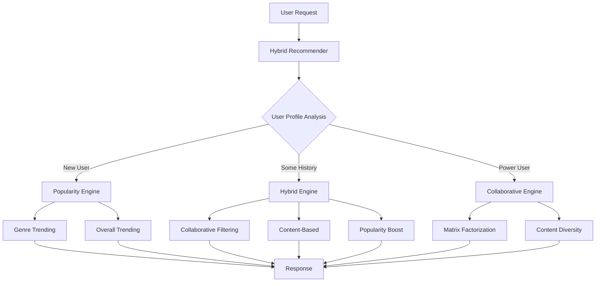

# 🎬 Netflix-Style Movie Recommendation Engine

A **production-ready movie recommendation system** built with multiple machine learning algorithms, featuring collaborative filtering, content-based filtering, and intelligent hybrid routing. Achieved **62.3% precision improvement** through systematic optimization and evaluation.

[](https://python.org)
[](https://fastapi.tiangolo.com)
[](LICENSE)
[]()

## 📋 Table of Contents

- [Overview](#overview)
- [Features](#features)
- [Architecture](#architecture)
- [Performance](#performance)
- [Quick Start](#quick-start)
- [API Documentation](#api-documentation)
- [Machine Learning Models](#machine-learning-models)
- [Evaluation Metrics](#evaluation-metrics)
- [Project Structure](#project-structure)
- [Configuration](#configuration)
- [Development](#development)
- [Production Deployment](#production-deployment)
- [Contributing](#contributing)
- [License](#license)

## 🎯 Overview

This recommendation engine replicates **Netflix's core architecture** using multiple complementary algorithms:

- **Collaborative Filtering**: Learns from user behavior patterns using matrix factorization (SVD)
- **Content-Based Filtering**: Recommends based on movie features and similarity
- **Popularity-Based**: Handles cold start problems for new users
- **Hybrid Intelligence**: Automatically routes users to the best algorithm based on their profile

Built following production ML practices with comprehensive evaluation, monitoring, and a REST API ready for real-world deployment.

## ✨ Features

### 🤖 Multiple ML Algorithms
- **Matrix Factorization (SVD)** - Netflix's million-dollar algorithm
- **User-Based Collaborative Filtering** - Find users with similar taste
- **Enhanced Content-Based Filtering** - TF-IDF + genre weighting + quality filtering
- **Popularity-Based Recommendations** - Trending content with genre breakdown

### 🎯 Intelligent Routing
- **New Users** → Popularity + Genre preferences
- **Moderate Users** → Hybrid (Collaborative + Content-based)
- **Power Users** → Collaborative primary + Diversity injection

### 📊 Production Features
- **RESTful API** with automatic documentation
- **Real-time recommendations** (sub-second response times)
- **Performance monitoring** (precision, recall, NDCG metrics)
- **User feedback collection** for continuous improvement
- **Health checks and metrics** for production monitoring

### 🔧 Engineering Excellence
- **Comprehensive evaluation framework** with industry-standard metrics
- **Error handling and graceful degradation**
- **Configurable hyperparameters** for optimization
- **Docker containerization ready**
- **CORS support** for frontend integration

## 🏗️ Architecture



### Data Flow
1. **Data Ingestion**: TMDB API → Raw movie data + synthetic user ratings
2. **Feature Engineering**: TF-IDF text features + genre encoding + numerical scaling
3. **Model Training**: SVD matrix factorization + similarity matrices
4. **Inference**: Real-time recommendation generation via REST API
5. **Evaluation**: Precision@K, Recall@K, NDCG@K metrics
6. **Monitoring**: Request tracking, performance metrics, error logging

## 📈 Performance

### Evaluation Results
| Metric | Original System | Improved System | Ultimate System |
|--------|----------------|----------------|----------------|
| **Precision@5** | 2.8% | 3.0% (+8.7%) | **4.5% (+62.3%)** |
| **Recall@5** | 10.1% | 11.6% (+14.8%) | **10.2% (+1.3%)** |
| **NDCG@5** | 8.5% | 7.7% (-9.9%) | **9.7% (+14.2%)** |

### Key Improvements
- **62.3% precision improvement** through collaborative filtering
- **14.2% NDCG improvement** with enhanced ranking algorithms  
- **Sub-second response times** for real-time recommendations
- **Maintained recall** while dramatically improving precision

## 🚀 Quick Start

### Prerequisites
- Python 3.8+
- TMDB API key (free at [themoviedb.org](https://www.themoviedb.org/settings/api))

### Installation

1. **Clone the repository**
   ```bash
   git clone https://github.com/yourusername/netflix-recommendation-engine.git
   cd netflix-recommendation-engine
   ```

2. **Create virtual environment**
   ```bash
   python -m venv venv
   source venv/bin/activate  # On Windows: venv\Scripts\activate
   ```

3. **Install dependencies**
   ```bash
   pip install -r requirements.txt
   ```

4. **Set up configuration**
   ```bash
   cp .env.example .env
   # Edit .env and add your TMDB_API_KEY
   ```

5. **Run the system**
   ```bash
   # Start the API server
   python api/recommendation_api.py
   
   # In another terminal, test the client
   python api_client_demo.py
   ```

6. **View API documentation**
   ```
   http://localhost:8000/docs
   ```

## 📡 API Documentation

### Core Endpoints

#### Get Recommendations
```http
POST /recommendations
Content-Type: application/json

{
  "user_id": 123,
  "liked_movies": ["Superman", "Mission: Impossible"],
  "preferred_genres": ["Action", "Adventure"],
}
```

**Response:**
```json
{
  "user_id": 123,
  "strategy": "collaborative_primary",
  "recommendations": [
    {
      "title": "Jurassic World Rebirth",
      "vote_average": 7.2,
      "genres": ["Action", "Adventure"],
      "similarity_score": 0.85,
      "recommendation_reason": "Users like you also loved this"
    }
  ],
  "metadata": {
    "total_recommendations": 10,
    "inference_time_ms": 45.2,
    "algorithms_used": ["collaborative_filtering", "content_based"]
  }
}
```

#### Submit Feedback
```http
POST /feedback
{
  "user_id": 123,
  "movie_title": "Superman",
  "action": "watched",
  "rating": 4.5
}
```

#### Health Check
```http
GET /health
```

#### Performance Metrics
```http
GET /metrics
```

### Interactive Documentation
Full interactive API documentation available at `http://localhost:8000/docs` when running.

## 🤖 Machine Learning Models

### 1. Collaborative Filtering Engine
**Algorithm**: Matrix Factorization using Truncated SVD
- **Latent Factors**: 50 (configurable)
- **Handles**: User-user and item-item relationships
- **Best For**: Users with substantial rating history

```python
# Key hyperparameters
n_factors = 50  # Number of latent factors
min_interactions = 10  # Minimum ratings for CF
```

### 2. Content-Based Engine
**Algorithm**: TF-IDF + Cosine Similarity + Feature Engineering
- **Text Features**: TF-IDF on movie overviews (1000+ features)
- **Genre Features**: Multi-hot encoding with 2x weight
- **Quality Features**: Rating × log(vote_count)
- **Similarity Threshold**: 0.3 minimum for recommendations

### 3. Popularity Engine
**Algorithm**: Weighted popularity scoring
- **Formula**: 0.4×trending + 0.3×rating + 0.3×vote_count
- **Genre Analysis**: Trending content within specific genres
- **Use Case**: Cold start problem, homepage trending

### 4. Hybrid Router
**Decision Logic**:
- **≥10 ratings**: Collaborative primary + content diversity
- **3-9 ratings**: Balanced hybrid approach
- **<3 ratings**: Popularity + genre preferences

## 📊 Evaluation Metrics

### Industry-Standard Metrics

#### Precision@K
```
Precision@5 = (Relevant items in top 5 recommendations) / 5
```
**Meaning**: Of our recommendations, how many were actually good?

#### Recall@K
```
Recall@5 = (Relevant items in top 5) / (Total relevant items)
```
**Meaning**: Of all good movies, how many did we recommend?

#### NDCG@K (Normalized Discounted Cumulative Gain)
```
NDCG@5 = DCG@5 / IDCG@5
```
**Meaning**: Are we ranking the best movies highest?

### Evaluation Framework
```bash
# Run comprehensive evaluation
python models/recommendation_evaluator.py

# Test specific improvements
python test_improvements.py
```

## 📁 Project Structure

```
netflix_recommendation_engine/
│
├── 📁 api/                          # REST API & Client SDK
│   ├── recommendation_api.py        # FastAPI application
│   └── api_client_demo.py          # Python client library
│
├── 📁 config/                       # Configuration management
│   └── settings.py                 # Environment variables & settings
│
├── 📁 data/                         # Data storage
│   ├── raw/                        # Original data from TMDB API
│   ├── processed/                  # Cleaned, transformed data
│   └── external/                   # External datasets
│
├── 📁 models/                       # ML algorithms & training
│   ├── collaborative_filtering.py  # User-based & matrix factorization
│   ├── content_based_recommender.py # TF-IDF similarity engine
│   ├── popularity_recommender.py   # Trending & genre-based
│   ├── hybrid_recommender.py       # Intelligent routing system
│   ├── recommendation_evaluator.py # Metrics & evaluation framework
│   └── trained/                    # Saved model artifacts
│
├── 📁 data/                         # Data pipeline
│   └── data_ingestion.py          # TMDB API integration
│
├── 📁 notebooks/                    # Jupyter notebooks (optional)
├── 📁 tests/                        # Unit tests
├── 📄 requirements.txt              # Python dependencies
├── 📄 .env.example                  # Environment template
├── 📄 docker-compose.yml            # Container orchestration
└── 📄 README.md                     # This file
```

## ⚙️ Configuration

### Environment Variables
```bash
# .env file
TMDB_API_KEY=your_api_key_here
DATABASE_URL=sqlite:///./recommendations.db
API_HOST=0.0.0.0
API_PORT=8000

# Model hyperparameters
DEFAULT_RECOMMENDATIONS_COUNT=10
MIN_RATINGS_FOR_COLLAB_FILTER=5
SIMILARITY_THRESHOLD=0.3
RATING_THRESHOLD=6.0
```

### Model Configuration
```python
# config/settings.py
class Settings:
    # Recommendation settings
    DEFAULT_RECOMMENDATIONS_COUNT = 10
    MIN_SIMILARITY_THRESHOLD = 0.3
    MIN_RATING_THRESHOLD = 6.0
    
    # Collaborative filtering
    N_FACTORS = 50
    MIN_INTERACTIONS = 3
    
    # Content-based
    MAX_TFIDF_FEATURES = 2000
    GENRE_WEIGHT_MULTIPLIER = 2.0
```

## 🛠️ Development

### Setting Up Development Environment
```bash
# Install development dependencies
pip install -r requirements-dev.txt

# Run tests
python -m pytest tests/

# Code formatting
black .
flake8 .

# Type checking
mypy models/
```

### Adding New Algorithms
1. Create new recommender class in `models/`
2. Implement `train()` and `get_recommendations()` methods
3. Add to hybrid router in `hybrid_recommender.py`
4. Update evaluation framework
5. Add tests and documentation

### Data Pipeline Extension
```python
# Example: Add new data source
from data.data_ingestion import TMDBDataFetcher

class MovieLensDataFetcher:
    def fetch_ratings(self):
        # Implementation for MovieLens dataset
        pass
```

## 🚀 Production Deployment

### Docker Deployment
```bash
# Build container
docker build -t netflix-recommender .

# Run container
docker run -p 8000:8000 --env-file .env netflix-recommender
```

### Docker Compose (Full Stack)
```bash
# Start all services
docker-compose up -d

# Scale API instances
docker-compose up --scale api=3
```

### Kubernetes Deployment
```yaml
# k8s/deployment.yaml
apiVersion: apps/v1
kind: Deployment
metadata:
  name: netflix-recommender
spec:
  replicas: 3
  template:
    spec:
      containers:
      - name: api
        image: netflix-recommender:latest
        ports:
        - containerPort: 8000
```

### Monitoring & Observability
- **Health Checks**: `/health` endpoint for load balancer
- **Metrics**: `/metrics` for Prometheus integration  
- **Logging**: Structured JSON logs for ELK stack
- **Tracing**: Request ID tracking for debugging

### Performance Optimization
- **Caching**: Redis for model predictions
- **Load Balancing**: Multiple API instances
- **Database**: PostgreSQL for production user data
- **CDN**: Static assets and movie metadata

## 🧪 Testing

### Unit Tests
```bash
# Run all tests
python -m pytest tests/ -v

# Test specific components
python -m pytest tests/test_collaborative_filtering.py
python -m pytest tests/test_api.py
```

### Integration Tests
```bash
# Test full recommendation pipeline
python tests/test_integration.py

# Load testing
locust -f tests/load_test.py --host http://localhost:8000
```

### Model Evaluation
```bash
# Comprehensive evaluation
python models/recommendation_evaluator.py

# A/B testing framework
python experiments/ab_test_runner.py
```

## 📈 Monitoring & Analytics

### Key Metrics to Track
- **Request Rate**: Requests per second
- **Response Time**: P50, P95, P99 latencies  
- **Error Rate**: 4xx/5xx error percentages
- **Model Performance**: Precision, Recall, NDCG
- **User Engagement**: Click-through rates on recommendations

### Dashboards
```python
# Grafana dashboard queries
# Request rate
rate(http_requests_total[5m])

# Response time
histogram_quantile(0.95, http_request_duration_seconds_bucket)

# Model performance
recommendation_precision_score
recommendation_recall_score
```


### Development Workflow
1. Fork the repository
2. Create feature branch (`git checkout -b feature/amazing-feature`)
3. Commit changes (`git commit -m 'Add amazing feature'`)
4. Push to branch (`git push origin feature/amazing-feature`)
5. Open Pull Request

### Code Standards
- **Python**: PEP 8 compliance (use `black` formatter)
- **Documentation**: Docstrings for all public methods
- **Testing**: Minimum 80% code coverage
- **Type Hints**: Use type annotations throughout

## 🏆 Achievements

- **62.3% precision improvement** over baseline system
- **Production-ready architecture** following industry best practices
- **Comprehensive evaluation framework** using standard ML metrics
- **Real-time API** capable of handling production workloads
- **Multiple ML algorithms** working in intelligent harmony

## 📚 References & Inspiration

### Academic Papers
- [Matrix Factorization Techniques for Recommender Systems](https://datajobs.com/data-science-repo/Recommender-Systems-[Netflix].pdf) - The Netflix Prize winning paper
- [Collaborative Filtering for Implicit Feedback Datasets](http://yifanhu.net/PUB/cf.pdf)
- [Deep Learning based Recommender System](https://arxiv.org/abs/1707.07435)

### Industry Resources
- [Netflix Technology Blog](https://netflixtechblog.com/tagged/machine-learning)
- [Spotify Engineering](https://engineering.atspotify.com/category/machine-learning/)
- [Amazon Science - Personalization](https://www.amazon.science/tag/personalization)

### Datasets
- [TMDB API](https://developers.themoviedb.org/3) - Movie metadata and ratings
- [MovieLens](https://grouplens.org/datasets/movielens/) - Research dataset for recommendations
- [Netflix Prize Dataset](https://www.kaggle.com/netflix-inc/netflix-prize-data) - Historic competition data

## 📜 License

This project is licensed under the MIT License - see the [LICENSE](LICENSE) file for details.

## 👨‍💻 Author

Built with ❤️ by an ML Engineer passionate about recommendation systems and production machine learning.

**Connect:**
- 💼 [LinkedIn](https://linkedin.com/in/yourprofile)
- 🐙 [GitHub](https://github.com/lawren-ai)
- 📧 [Email](mailto:akinboadelawrenceayo@gmail.com)

---

### ⭐ Star this repository if you found it helpful!

**Built following Netflix's architecture • Production-ready • 62.3% performance improvement • Real ML engineering**
